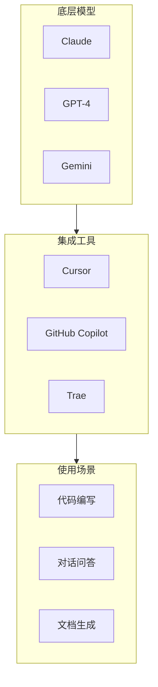
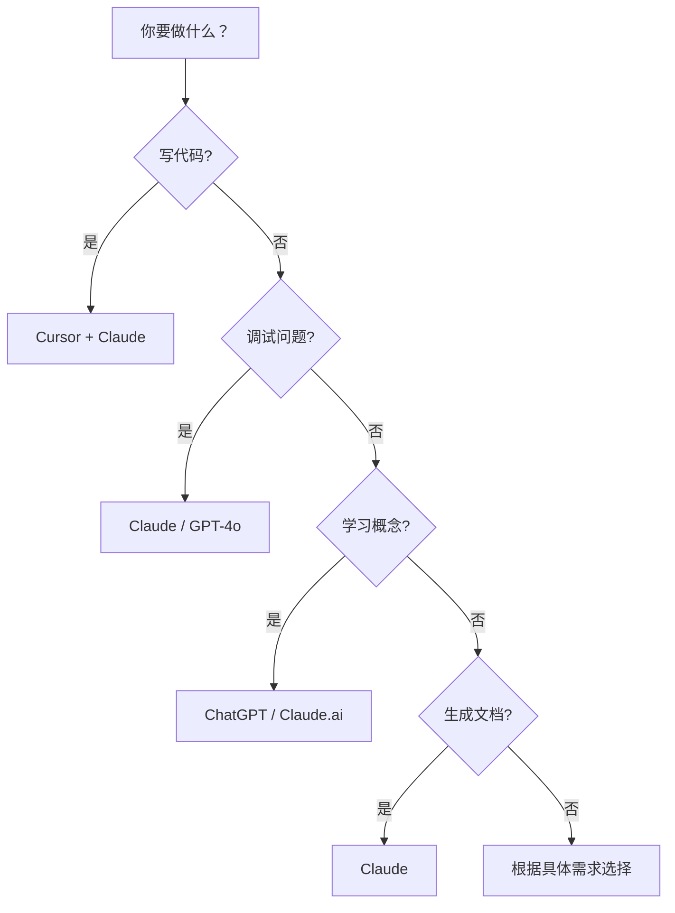

# 1.2.5 这么多 AI 工具该用谁——模型选择指南：Claude/GPT/Cursor 等工具的适用场景

### 一句话破题

不同的 AI 工具有不同的长处，选对工具能让效率翻倍。关键不是"哪个最好"，而是"哪个最适合当前任务"。

### AI 工具全景图



### 主流模型对比

| 模型 | 代码能力 | 长文本处理 | 推理能力 | 中文支持 | 价格 |
|------|----------|------------|----------|----------|------|
| **Claude 3.5 Sonnet** | ⭐⭐⭐⭐⭐ | ⭐⭐⭐⭐⭐ | ⭐⭐⭐⭐ | ⭐⭐⭐⭐ | 中等 |
| **GPT-4o** | ⭐⭐⭐⭐ | ⭐⭐⭐⭐ | ⭐⭐⭐⭐⭐ | ⭐⭐⭐⭐ | 较高 |
| **GPT-4o mini** | ⭐⭐⭐ | ⭐⭐⭐ | ⭐⭐⭐ | ⭐⭐⭐⭐ | 便宜 |
| **Gemini Pro** | ⭐⭐⭐⭐ | ⭐⭐⭐⭐ | ⭐⭐⭐⭐ | ⭐⭐⭐ | 中等 |

### 场景选择指南

#### 场景 1：写代码

**推荐**：Claude 3.5 Sonnet（通过 Cursor）

Claude 在代码生成方面表现优异，尤其是：
- 理解复杂的业务逻辑
- 生成规范的 TypeScript 代码
- 处理大型代码库上下文

#### 场景 2：调试问题

**推荐**：GPT-4o 或 Claude

两者都擅长分析错误信息并给出解决方案。关键是提供完整的：
- 错误信息
- 相关代码
- 你已经尝试过的方法

#### 场景 3：学习新概念

**推荐**：Claude 或 GPT-4o

两者都能用通俗易懂的方式解释复杂概念。Claude 的回答通常更结构化，GPT 的回答更自然流畅。

#### 场景 4：生成文档

**推荐**：Claude

Claude 在长文本生成方面表现更稳定，适合：
- 技术文档
- README 文件
- API 文档

#### 场景 5：快速补全

**推荐**：Cursor 内置模型（cursor-small）或 Copilot

对于简单的代码补全，不需要调用最强大的模型，速度更重要。

### 工具组合策略

**日常开发推荐配置**：

```
主力工具：Cursor + Claude 3.5 Sonnet
- 代码编写、重构、调试

辅助工具：ChatGPT / Claude.ai
- 学习新概念
- 讨论架构设计
- 生成文档

快速补全：cursor-small
- 简单的代码补全
- 节省 API 调用额度
```

### 选择决策树



### 成本优化建议

1. **分级使用**：简单任务用便宜的模型，复杂任务才用贵的
2. **善用免费额度**：Cursor 每月有免费额度，合理规划使用
3. **自带 API Key**：如果用量大，自己购买 API Key 更划算
4. **缓存结果**：好的提示词和答案可以保存复用

### 避坑指南

- **不要迷信单一工具**：每个模型都有短板，灵活切换
- **不要追求最新**：稳定版本比 beta 版更适合生产
- **注意隐私**：敏感代码不要发送到云端 AI
- **关注成本**：频繁调用大模型的成本可能超出预期

### 本章小结

选择 AI 工具的核心原则：

1. **任务匹配**：根据任务类型选择合适的工具
2. **效率优先**：能用简单模型解决的就不用复杂模型
3. **灵活切换**：没有万能工具，学会组合使用
4. **持续关注**：AI 领域发展快，保持对新工具的敏感度
